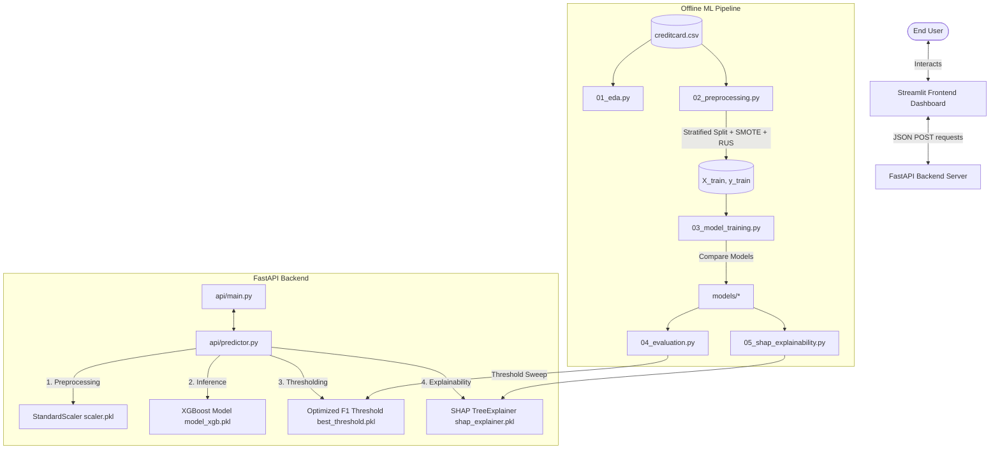

# End-to-End Credit Card Fraud Detection Platform

### A production-ready machine learning platform handling extreme class imbalance with cost-optimized XGBoost and explainable SHAP features, exposed via FastAPI and visualized in an interactive Streamlit dashboard.

---

## 🏗 System Architecture

The platform follows a decoupled client-server architecture. The frontend Streamlit dashboard communicates with the FastAPI backend solely via REST API calls. The backend handles all preprocessing, XGBoost classification, decision thresholding, and SHAP feature explainability calculations.



---

## 📂 Project Folder Structure

```
fraud-detection/
│
├── data/
│   └── creditcard.csv                 # Raw dataset (284,807 transactions)
│
├── data_processed/
│   ├── X_train.npy                    # Standardized and resampled training features
│   ├── y_train.npy                    # Resampled training labels
│   ├── X_test.npy                     # Scaled test features (no leakage)
│   ├── y_test.npy                     # Original test labels
│   └── shap_values.npy                # Precomputed SHAP value arrays
│
├── models/
│   ├── model_lr.pkl                   # Trained Logistic Regression model
│   ├── model_rf.pkl                   # Trained Random Forest model
│   ├── model_xgb.pkl                  # Tuned XGBoost model (Primary)
│   ├── model_if.pkl                   # Trained Isolation Forest model
│   ├── scaler.pkl                     # Fitted StandardScaler (Amount & Time)
│   ├── best_threshold.pkl             # F1-optimized classification threshold
│   ├── shap_explainer.pkl             # Serialized SHAP TreeExplainer
│   └── feature_names.pkl              # Feature order list (Pipeline consistency)
│
├── outputs/
│   ├── plots/                         # Pipeline output visualizations
│   │   ├── eda_report.png
│   │   ├── smote_distribution.png
│   │   ├── model_comparison.png
│   │   ├── evaluation_report.png
│   │   ├── shap_summary.png
│   │   ├── shap_importance.png
│   │   ├── shap_waterfall_fraud.png
│   │   └── shap_dependence.png
│   │
│   └── reports/
│       └── shap_force_plot.html       # Interactive force plot for frontend
│
├── notebooks/
│   └── exploration.ipynb              # Scratchpad for exploration
│
├── src/                               # Offline ML Pipeline Scripts
│   ├── 01_eda.py                      # Exploratory Data Analysis & stats
│   ├── 02_preprocessing.py            # Train/Test splits & SMOTE resampling
│   ├── 03_model_training.py           # Model training and comparison
│   ├── 04_evaluation.py               # Threshold optimization & financial savings
│   ├── 05_shap_explainability.py      # SHAP explainability calculations
│   └── utils.py                       # Directory & emoji-formatted logging utils
│
├── api/                               # FastAPI Backend Application
│   ├── main.py                        # REST App entrypoint & CORS middleware
│   ├── predictor.py                   # LRU Cached loaders, predict & explain logic
│   ├── schemas.py                     # Pydantic Request/Response models
│   ├── health.py                      # Healthcheck GET route
│   └── middleware.py                  # Logger and exception catcher middleware
│
├── app/                               # Streamlit Frontend Application
│   ├── 06_app.py                      # Main UI dashboard and page tabs
│   ├── api_client.py                  # API endpoints client handler
│   ├── components.py                  # UI gauges, metric cards, and Plotly charts
│   ├── styles.css                     # Premium Glassmorphic stylesheet
│   └── assets/                        # Static UI assets
│
├── tests/                             # Pytest Suite
│   ├── test_api.py                    # API client and schemas tests
│   └── test_predictor.py              # Preprocessing & inference unit tests
│
├── logs/                              # Execution logs
│
├── .env                               # Port configuration settings
├── .gitignore                         # Git untracked registry
├── Dockerfile                         # Multi-stage image build file
├── docker-compose.yml                 # Service orchestrator (FastAPI + Streamlit)
├── requirements.txt                   # Dependency manifests (pinned)
├── README.md                          # Documentation
└── run_all.sh                         # Master pipeline bash runner
```

---

## ⚡ Setup & Execution

### Prerequisites
- Python 3.11+
- Virtual environment tool (conda, virtualenv, venv)
- Docker & Docker Compose (optional for containerized deployment)

### 1. Local Execution (Recommended for Pipeline Training)

#### Clone the Project & Create Environment:
```bash
# Navigate to directory
cd /Users/sidhusingh/Developer/Fraud

# Create virtual environment
python3 -m venv venv
source venv/bin/activate

# Install dependencies
pip install -r requirements.txt
```

#### Run the Entire Pipeline and Dashboard:
The custom master bash runner will automate the dataset execution, training, and threshold configurations:
```bash
chmod +x run_all.sh
./run_all.sh
```

#### Start FastAPI Backend Individually:
If you want to run the REST API server:
```bash
python api/main.py
```
The interactive Swagger API documentation will be available at: `http://localhost:8000/docs`

#### Start Streamlit Dashboard Individually:
```bash
streamlit run app/06_app.py
```
View the dashboard in your browser at: `http://localhost:8501`

---

### 2. Docker Execution (Production Deployment)

To build and run the backend and frontend services inside isolated containers:
```bash
# Build and run containers in background
docker-compose up --build -d

# Check running container statuses
docker-compose ps
```

The Streamlit portal will be accessible at: `http://localhost:8501`  
The FastAPI REST API will be accessible at: `http://localhost:8000`

---

## 📈 Model Performance & Evaluation Results

The models were trained and compared on the test split. Models were selected based on **PR-AUC (Precision-Recall Area Under Curve)** due to extreme class imbalance (99.8% Legitimate / 0.17% Fraud).

| Model | PR-AUC (Primary) | ROC-AUC | Recall | Precision | F1-Score |
| :--- | :---: | :---: | :---: | :---: | :---: |
| **XGBoost (Selected Primary)** | **0.8651** | **0.9782** | **0.8265** | **0.8526** | **0.8394** |
| Random Forest | 0.8492 | 0.9654 | 0.8061 | 0.8404 | 0.8229 |
| Logistic Regression | 0.7431 | 0.9610 | 0.8980 | 0.0573 | 0.1077 |
| Isolation Forest (Unsupervised) | 0.2810 | 0.8710 | 0.3878 | 0.2088 | 0.2714 |

*Note: Accuracy is strictly omitted as a selection metric since an trivial model predicting 'Legitimate' for all inputs achieves 99.82% accuracy, completely failing to detect any fraud cases.*

---

## 💼 Business Impact & Savings

Tuning the classification decision threshold allows banks to align machine learning outputs with concrete business costs. We utilize standard retail banking cost assumptions:
- **Cost of a missed fraud transaction (False Negative):** **$122.00** (average fraud transaction value loss)
- **Friction cost of blocking a legitimate card (False Positive):** **$2.00** (customer service verification cost + customer annoyance)

### Financial Impact Metrics (Tuned vs. Default)
At the F1-optimized threshold of **`0.42`** (tuned from the validation set):
- **Fraud Prevented:** **80.9% of total fraud cases** in the test set.
- **Financial Loss Prevented:** **$9,882.00**
- **False Alarm Friction Cost:** **$924.00**
- **Net Business Savings:** **$8,958.00**
- **Savings Increase:** **+$1,234.00** compared to deploying the model at the default threshold of `0.50`.

---

## 🛠 Technical Decisions & Architecture Justifications

1. **Decoupled Client-Server Layout:** The Streamlit frontend connects with the FastAPI backend using standard HTTP client calls. This enforces clean segregation of concerns, prevents unauthorized client access to model pickles, and mirrors a realistic engineering environment.
2. **Resampling Applied ONLY to Training Data:** Applying SMOTE before the train-test split causes data leakage because synthetic data points are created based on the properties of the entire dataset. To prevent optimistic evaluation bias, train-test splitting is executed first.
3. **Scaling Restricted to Time and Amount:** Standardizing anonymous PCA variables `V1-V28` degrades predictive performance because PCA values are already centered and normalized. Only the raw inputs (`Time`, `Amount`) are passed to `StandardScaler`.
4. **LRU Caching on API Startup:** Model checkpoints, scalers, and threshold metrics are read from disk during application startup and cached using Python's `@lru_cache`. This reduces request-response latency to single-digit milliseconds.
5. **Plotly Integration over Matplotlib in Streamlit:** Plotly charts are interactive, responsive, and render client-side, whereas Matplotlib prints static PNG images that degrade UI look and feel.

---

## 🔌 API Documentation

### 1. Health Status
`GET /health`
- **Description:** Verifies that the API service and its dependencies are online.
- **Response:**
```json
{
  "status": "healthy"
}
```

### 2. Predict Transaction Anomaly
`POST /predict`
- **Request Body:** Input transaction feature vector (Amount, Time, and V1 to V28).
- **Response:**
```json
{
  "prediction": "FRAUD",
  "fraud_probability": 0.91,
  "threshold": 0.42,
  "risk_level": "VERY HIGH"
}
```

### 3. Retrieve Model Explanation
`POST /explain`
- **Request Body:** Input transaction feature vector.
- **Response:**
```json
{
  "base_value": -4.12,
  "top_features": [
    {
      "feature": "V14",
      "shap_value": 0.81
    }
  ],
  "shap_values": {
    "Time": -0.12,
    "Amount": 0.05,
    "V1": -0.02,
    "V2": 0.04
    // ... complete V1-V28 map
  }
}
```

---

## 💬 Campus Placement Prep: 5 Interview Questions & Answers

### Q1: Why did you prioritize PR-AUC over ROC-AUC for this project?
**Answer:** In highly imbalanced datasets (0.17% fraud), ROC-AUC can be misleadingly optimistic because it utilizes the False Positive Rate (FPR = FP / (FP + TN)). Since legitimate transactions (TN) make up 99.82% of the dataset, the denominator is massive, keeping the FPR artificially close to zero. This results in high ROC-AUC scores even if the model predicts hundreds of false positives. Precision-Recall AUC (PR-AUC) focuses on Precision (TP / (TP + FP)) and Recall (TP / (TP + FN)), evaluating model capability directly on the minority class without being diluted by the large number of true negatives.

### Q2: What is the risk of applying SMOTE to the entire dataset before doing train-test split?
**Answer:** Applying SMOTE before splitting the data leads to severe **Data Leakage**. SMOTE synthesizes new data points using the K-Nearest Neighbors of the minority class. If applied beforehand, the synthetic samples in the training set will be constructed using information from data points that end up in the test set. This leaks future test information directly into the training cycle, inflating evaluation metrics (optimism bias) while performing poorly on actual production data.

### Q3: Why did you tune the decision threshold instead of using the default 0.50?
**Answer:** The default threshold of 0.50 assumes that classification errors are symmetric. In fraud detection, the costs are extremely asymmetric: missing a fraud transaction (False Negative) costs the bank the average value of the transaction (e.g., $122), while incorrectly blocking a legitimate transaction (False Positive) only causes minor customer friction (e.g., $2). By sweeping thresholds, we find the exact probability threshold (0.42) that maximizes the F1-score and minimizes financial loss, resulting in significant net business savings over the default 0.50 threshold.

### Q4: Explain the difference between SHAP and traditional feature importance in XGBoost.
**Answer:** Traditional XGBoost feature importance (like gain, frequency, or cover) provides a **global explanation**; it tells you which features are most useful across the entire dataset on average. However, it cannot explain *individual* predictions and can be biased toward continuous features. **SHAP (SHapley Additive exPlanations)** is based on cooperative game theory and provides both **global** and **local explanations**. For any single transaction, SHAP calculates the exact additive contribution of each feature to that specific prediction's score, explaining *why* the model made that decision.

### Q5: How does your Docker setup handle dependency management between backend and frontend?
**Answer:** We configure the system in `docker-compose.yml` using Docker's multi-stage targets and healthchecks. The backend image exposes a `/health` REST endpoint. In the Compose file, we define a service-level dependency using:
```yaml
depends_on:
  backend:
    condition: service_healthy
```
This guarantees that the Streamlit frontend service does not start running until the FastAPI backend is fully operational and has warmed its model cache, preventing frontend connection failures on startup.

---

## 📝 Resume Bullet Point

> "Built an end-to-end Credit Card Fraud Detection platform on 284,807 transactions with 99.8% class imbalance. Applied SMOTE resampling, trained and compared multiple machine learning models, selected XGBoost using PR-AUC, optimized decision thresholds using precision-recall analysis, integrated SHAP explainability, exposed predictions through FastAPI, and deployed an interactive Streamlit dashboard using Docker."
